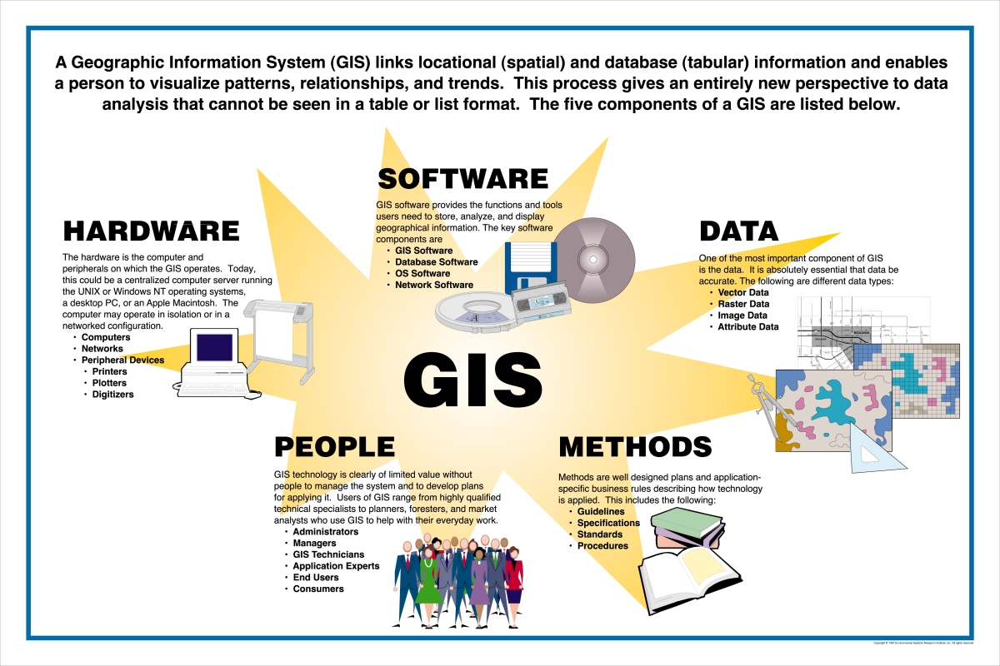
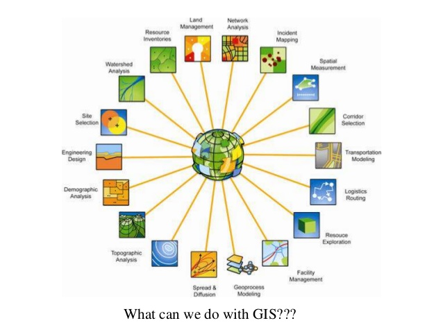

@title[gis resources @ uofl]
### GIS/Geospatial Technology 
### Resources
#### @ UofL
###### D.J. Biddle, GISP
---
@title[the plan]
### the plan
- What is GIS?
- GIS in support of env. policy research & practice
- Examples from UofL EHS
- GIS Resources @ UofL
- Helpful links
---
### What is GIS? 
> @size[.6em](A geographic information system <GIS> is a framework for gathering, managing, and analyzing data. Rooted in the science of geography, GIS integrates many types of data. It analyzes spatial location and organizes layers of information into visualizations using maps and 3D scenes. ​With this unique capability, GIS reveals deeper insights into data, such as patterns, relationships, and situations—helping users make smarter decisions.) 
###### -Environmental Research Systems Institute (ESRI)
+++

+++

+++

---
### GIS Support for Environmental Policy 
### Research and Practice
+++
##### Asset Mapping
- Data collection using GPS equipment
- Digitized from existing plans/blueprints
- Provide representation of spatial distribution of assets/hazards
+++

---
##### Risk/Vulnerability Modeling
- Combine various natural and social components of risk or vulnerability to environmental hazards to provide composite picture of risk/vulnerability.
- Reduce technical information into more meaningful and actionable knowledge for decision/policy makers
+++
- Map from: https://www.nj.gov/dep/cmp/czm_cvi.html 

- Map from: https://www.nj.gov/dep/cmp/czm_cvi.html 
---
##### Demographic Analysis
- Where are vulnerable populations located?
- How do environmental hazards differential impact different social groups
- Environmental Justice? 
+++

+++

---
##### Information Dissemination/Storytelling
- Story Maps convey place-based narratives about a topic or idea
- Mashups of maps, text, and multimedia in an interactive web applications
- Effective and engaging communication in a web browser
- https://storymaps.esri.com

+++
-Familiar Examples? 
<iframe class="stretch" data-src="https://centerforgis.maps.arcgis.com/apps/Cascade/index.html?appid=08c2849d3f1649758e40b8cfa67d0248"></iframe>
+++
<iframe class="stretch" data-src="https://centerforgis.maps.arcgis.com/apps/MapSeries/index.html?appid=e7fd5854dbab435b944c27913df01980"></iframe>
+++
<iframe class="stretch" data-src="https://centerforgis.maps.arcgis.com/apps/Cascade/index.html?appid=307e73fffa6f4206b9d356459998b607"></iframe>
---
##### GIS Resources @ UofL
- UofL Center for GIS
> @size[.6em](Established in 1996, the mission of the University of Louisville Center for Geographic Information Sciences is to provide instruction, applications, and research in geographic information systems technology.  The resources of the Center for GIS are available to professional staff, students, and faculty to provide service and products to individuals and agencies of the University, and the local and state community.)
+++
- Maintain software licenses and hardware
- Support faculty and student research
- Offer training, both academic courses and web-based tutorials
- Data liasion: can help you find the data you are looking for
---
##### ESRI Software
- Proprietary GIS softwares for desktop/server/cloud
- ArcGIS for Desktop
  - installed on all machines in LU224/225
  - also available in Ekstrom Library
  - students: entitled to free 1-year trial for home use
+++
- ArcGIS Online
  - Cloud-based GIS
  - Story Maps live here
  - Public account is free...just visit https://www.arcgis.com
  - Organizational account: more capabilities
    - invitation only (send me an email at djbidd01@louisville.edu)
+++	
- Training
  - https://www.esri.com/training 
  - All web courses free to students
  - Also by invite only! (email me for this as well)
  - Take a class! GEOG558/559 are primary GIS courses

	

 